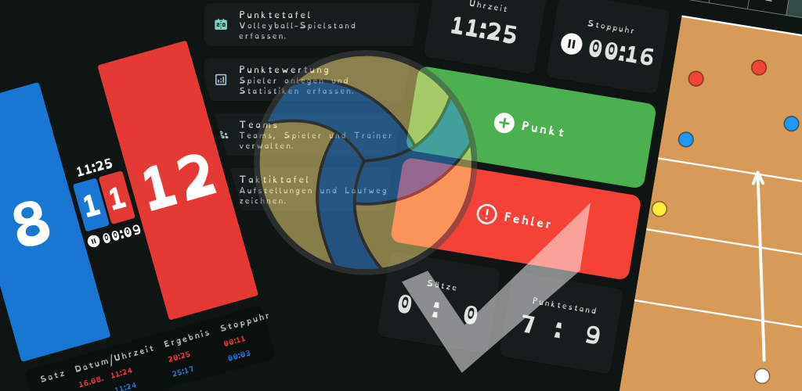

# VolleyAce

Volleyball Assistenz-App für Trainer, Spieler und Schiedsrichter.

- Punktetafel - Ersetzt die klassische Punktetafel
- Taktiktafel - Ersetzt die klassische Taktiktafel
- Teams - Spieler und Trainer verwalten, Teamstatistiken einsehen und Taktiken speichern.
- Punktewertung - Bewerten wie Punkte gemacht werden um eine Statistik zu Spielern und Teams zu erstellen.
- Training - Trainingspläne erstellen, Trainingsteilnahme erfassen, Trainingsstatistiken einsehen und Trainingsbewertungen erfassen.

## Technologie

- [x] Flutter/Dart
  - [x] Android
  - [ ] Web
  - [x] Windows/Linux
- Lokaler Storage: Sembast
  - Datei: `volley_ace.db` auf Desktop/Android
  - IndexedDB im Web
  - Settings-Store: `settings`, Datensatz `app`
- [ ] Cloud Sync
- [ ] Anmeldung
- [ ] Teams
  - [ ] Mitglieder
  - [ ] Trainer
- [ ] Sprachsteuerung (insbesondere für die Punktetafel)
- [x] Bildschirm aktiv lassen
- [ ] Resposives Design

## Features

- [x] Punktetafel
  - [x] Punktestände importieren
  - Zwei farbige Satzpunkt-Anzeigen (blau/rot)
  - Gewonnene Sätze in der Mitte
  - Nach unten wischen: Punkt vergeben
  - Nach oben wischen: letzten Punkt zurücknehmen
  - Nach links/rechts wischen: Seiten, Farben und Spielstände tauschen
  - Satzgewinn automatisch ab 25 Punkten mit zwei Punkten Vorsprung
  - [x] Uhr / Stop-Uhr
    - [x] Stop-Uhr automatisch starten wenn erster Punkt vergeben wird (damit sie zumindest verzögert startet...)
  - [x] Letzte Punkte pro Satz anzeigen
  - [x] Verlauf pro Satz anzeigen
  - [x] Auszeiten pro Team
        30 Sekunden Timer
        2 Stück pro Satz und Team
  - [ ] Rotation / Spielerwechsel (optional)
    - [ ] Spielinfos
      - [ ] Team A
        - [ ] Team (optional)
        - [ ] Spieler/Nummern
      - [ ] Team B
        - [ ] Team (optional)
        - [ ] Spieler/Nummern
      - [ ] Aufschlagteam
      - [ ] Spielklasse auswählen (U12, U13, U14, U15, U16, U18, U20, Damen, Herren, Mixed, Freizeit)
            Rotation/Position muss je nach Spielklasse unterschiedlich sein!
            U12-U13: 3 Spieler, U14-U15: 4 Spieler, Rest: 6 Spieler
            U12-U15: Rotation nach 2 Aufschlägen und bei Aufschlagwechsel, Rest: Rotation nach Aufschlagwechsel
    - [ ]  
      - [ ] Startaufstellung (Positionsnummern)
      - [ ] Ersatzspieler
      - [ ] Spielerwechsel
    - [ ] Anzeige in einem Spielfeld auf den jeweiligen Positionen 1-6
          Bei Punktvergabe soll Rotation berücksichtigt werden, manuell soll aber auch eine Rotation ausgelöst werden können (falls ein Team außerhalb der Punkte-Rotation rotieren möchte)
- [x] Taktiktafel
  - [x] Speichern von Taktiken
  - [x] Taktiken importieren
- [x] Team
  - [x] Info
    - [x] Teamname
    - [x] Teamlogo
    - [x] Teamfarben
    - [x] Spielklasse
    - [x] Teamprofil
    - [ ] Teamstatistik
    - [ ] Teambewertung
    - [ ] Achievements
  - [x] Spieler
    - [x] Name
    - [x] Trikotnummer
    - [x] Geburtsdatum / Alter
    - [x] Position
    - [x] Spielerprofil
    - [x] Spielerstatistik
      - [ ] Punktewertung
      - [ ] Trainingsstatistik
    - [ ] Spielerbewertung
    - [ ] Trainingsteilnahme
    - [ ] Trainingsbewertungen
    - [ ] Trainingsstände
    - [ ] Achievements
  - [x] Trainer
    - [x] Name
    - [x] Geburtsdatum / Alter
    - [x] Position
    - [x] Trainerprofil
    - [x] Trainerstatistik
    - [ ] Trainerbewertung
    - [ ] Achievements
- [x] Punktewertung
      Bewerten wie Punkte gemacht werden um eine Statistik zu Spielern und Teams zu erstellen.
      Es soll eine persistente Liste an Spielen geben, wird ein neues Spiel gestartet sollen die Spielinfos abgefragt werden.
      Wählt man ein Spiel aus, kann man entweder Punktewertung erfassen oder die Statistik einsehen.
  - [x] Spielinfos
        Abfragen beim Spielstart, um die Statistik zu speichern.
    - [x] Spielort
    - [x] Gegnerteam
    - [x] Spieltag / Datum (Heute) / Uhrzeit (Jetzt)
    - [x] Spieltyp (Liga, Turnier, Freundschaftsspiel, Trainingsspiel)
    - [x] Team / Spieler / Trainer
          Im Ersten Schritt pro Wertungsbogen Spieler (Name und Trikotnummer) mit + und - Buttons hinzufügen oder entfernen.
          Im zweiten Schritt Spieler aus dem Team welches vorab angelegt wird ausgewählt werden und die Punktewertung pro Spieler speichern.
    - [ ] Spielklasse
  - [x] Punktewertung erfassen
    - [x] Punkt / Fehler
          Zwei Buttons Grün und Rot die je für Punkt / Fehler stehen und dann zur Abfrage des Spielers scrollen.
          Spielstand / Uhrzeit / Stopuhr
          - [ ] Auszeiten pro Team anzeigen
          - [ ] Spielerwechsel pro Team anzeigen
          - [ ] Rotation für unsere Spieler anzeigen
    - [x] Wertung
          - Punkte
            Auswahl wie ein Punkt erreicht wurde.
            - Ass
            - Angriff
            - Block
            - Zuspieler-Finte
            - Gegnerfehler
            - Sonstiges
          - Fehler
            Auswahl Welcher Fehler gemacht wurde.
            - Aufschlag
            - Ball ins Aus
            - Ball ins Netz
            - Ball nicht rüber
            - Zugeschaut
            - Tusch
            - Übertritt
            - Netz Berührung
            - Fehler beim Hinterfeldangriff
            - Sonstiges
      - [x] Auszeit (wichtig für den Verlauf / Impact)
    - [x] Wer
          Spieler als Karte mit Name und Trikotnummer, die man nach oben oder unten scrollen kann, um den Spieler auszuwählen.
    - [x] Verlauf
    - [x] Statistik
      - [x] Spielstand
      - [x] Satzstand
      - [x] Punkte pro Art
      - [x] Fehler pro Art
      - [x] Diagram über Punkte/Fehler im Zeitverlauf
      - [x] Spieler
        - [x] Punkte / Fehler pro Spieler
        - [x] Punkte pro Art
        - [x] Fehler pro Art
        - [x] Diagram über Punkte/Fehler im Zeitverlauf
        - [ ] Aufklappbare Details pro Spieler
      - [ ] Export (Format das z.B. in Excel importiert werden kann)
- [x] Training
  - [x] Mehrere Trainings speichern
  - [x] Trainings teilen
  - [x] Trainings importieren
  - [x] Infos
    - [x] Name
    - [x] Datum / Uhrzeit
    - [x] Ort
    - [x] Dauer
    - [x] Beschreibung
    - [x] Team
  - [x] Trainingsteilnahme (Trainer, Spieler)
    - [x] Teilnahme
      - [ ] Manuell Trainer und Spieler hinzufügen
    - [x] Entschuldigt
    - [x] Unentschuldigt
  - [x] Trainingsplan mit Übungen, Sortierung, Abschluss und Überspringen
    - [x] Übungen
      - [x] Typ (Aufwärmen, Technik, Taktik, Spiel, Kraft, Ausdauer, Koordination, Dehnen, Cooldown)
      - [x] Ziel
      - [x] Dauer
      - [x] Beschreibung
  - [ ] Trainingsstatistik
  - [ ] Trainingsbewertung
- [ ] Trainingspläne
- [ ] Trainingsübungen
- [ ] Volley-Arcade

## ToDo

- [x] Toast ist weiß!
- [x] Landscape Modus Punktetafel soll automatisch Zoom machen (Pinch to Zoom entfernen)
- [x] Icon (z.B. taskbar)
- [x] Settings auf deutsch
- [-] Sportschrift
- [ ] Appname aktuell mit unterstich
- [x] Import / Export (Teams, Punktewertung, Taktiktafel)
  - [ ] Diff / import-Date vs. Änderungsdatum
- [x] Farbe rosa in die App übernehmen?
      -> Nehme doch das hellblau/mint
- [ ] Verlaufdarstellung wie einen Versionsgraphen
- [ ] Diagramm mit Differenzpunkten?
- [x] Zurück Geste soll nur eine Seite zurück gehen
- [x] Weitere Trainer in der Punktewertung optional hinzufügen
- [x] Button für Spieler hinzufügen in der Punktewertung ist vollflächig Rot.
- [x] Sicherheitsabfrage vor löschen
- [x] 2.Highlight-Color für Buttons Auswählbar, per default alles Orange
- [x] Punktewertung soll "Punktewertung" und nicht "match" als Namenhint 
